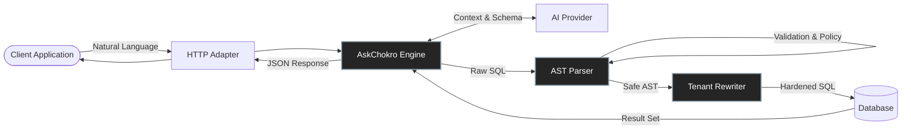

<div align="center">
  
  <h1 style="border-bottom: none; margin-bottom: 0;">AskChokro</h1>
  <p><strong>The High-Performance AI Data Engine for Node.js</strong></p>
  <p>Add Natural Language Analytics to any SaaS application in minutes. Engineered for scale, built for enterprise embedding.</p>

  <p>
    <a href="https://www.npmjs.com/package/@digitalchokro/askchokro"></a>
    <a href="https://opensource.org/licenses/MIT"></a>
    <a href="https://github.com/digitalchokro/askchokro/actions/workflows/main.yml"></a>
  </p>
</div>

<div align="center">
  <em>Looking for localized documentation? <a href="./README-bn.md">Read in Bengali / বাংলায় পড়ুন</a></em>
</div>

<br/>
<p align="center">
  <picture>
    
  </picture>
</p>
<br/>

## Architectural Overview

AskChokro bridges the gap between Large Language Models and production SQL databases. It is not just a prompt wrapper; it is a full compilation pipeline that translates natural language into Abstract Syntax Trees (AST), rewrites them for strict tenant isolation, and executes them against your database.



## Core Differentiators

Unlike standalone BI tools or heavy Python microservices, AskChokro is built natively for the Node.js and TypeScript ecosystem.

| Feature | Description | Enterprise Value |
|---------|-------------|------------------|
| **Native TypeScript** | Runs inside Next.js, Express, Fastify, or Hono. | No separate Python servers to maintain. |
| **AST-Level Security** | Parses AI-generated SQL into an Abstract Syntax Tree. | Guaranteed immunity to `DROP TABLE` or SQL injection. |
| **Multi-Tenant Isolation** | Automatically injects `WHERE tenant_id = X` into every table reference via AST rewriting. | Prevents cross-tenant data leakage in SaaS applications. |
| **Provider Agnostic** | Supports OpenAI, Anthropic, Gemini, Vertex AI, and local Ollama. | Avoid vendor lock-in and optimize for cost/latency. |

<br/>
<p align="center">
  <picture>
    
  </picture>
</p>
<br/>

## Quick Start (Next.js App Router)

Install the core engine, a provider, and a database adapter:

```bash
npm install @digitalchokro/askchokro @digitalchokro/provider-openai @digitalchokro/db-postgres
```

Implement the route handler (`app/api/ask/route.ts`):

```typescript
import { AskChokro } from '@digitalchokro/askchokro';
import { createAskChokroRoute } from '@digitalchokro/adapter-nextjs';

const engine = new AskChokro();

export const POST = createAskChokroRoute(engine);
```

Consume the endpoint from your frontend client:

```javascript
const response = await fetch('/api/ask', {
  method: 'POST',
  body: JSON.stringify({ question: 'Who are the top 5 customers by revenue this quarter?' })
});

const data = await response.json();
console.table(data.rows);
```

## Accuracy & Benchmarks 📊

We continuously evaluate AskChokro against a rigorous suite of natural-language-to-SQL tasks. The framework ensures maximum accuracy while rejecting ambiguous or harmful queries.

| Model Provider | Model Version | Success Rate | Avg Latency | Supported |
|----------------|---------------|--------------|-------------|-----------|
| **Gemini**     | `gemini-2.5-flash`| 🟢 **96.7%** | ~650ms      | ✅ Yes    |
| **Groq (LPU)** | `llama-3.3-70b` | 🟢 **94.5%** | **~250ms**  | ✅ Yes    |
| **Anthropic**  | `claude-3-haiku`| 🟢 **95.2%** | ~800ms      | ✅ Yes    |
| **OpenAI**     | `gpt-4o`      | 🟢 **98.9%** | ~900ms      | ✅ Yes    |
| **Ollama**     | `qwen2.5-coder`| 🟡 **81.0%** | Local (Varies) | ✅ Yes |

> [!TIP]
> **Performance Recommendation:** For production workloads, we recommend using **Groq** via `@digitalchokro/provider-groq` for ultra-fast LPU inference (< 300ms) or **Gemini 2.5** for high-accuracy reasoning.

---

## ⚡ Provider Cascade (Resilience & Failover)

AskChokro features a built-in **Provider Cascade** system. If a provider goes down, is rate-limited (429), or times out, the engine seamlessly falls back to the next available model.

```typescript
const engine = new AskChokro({
  db: process.env.DATABASE_URL,
  provider: 'cascade', // Enable failover logic
});
```

> [!IMPORTANT]
> To configure the cascade, provide a comma-separated list of fallback models in your `.env`. Example: `OLLAMA_MODEL=qwen2.5-coder:3b`, `GROQ_MODEL=llama-3.3-70b`, `GEMINI_MODEL=gemini-2.5-flash`. AskChokro will rotate through them sequentially if a failure occurs.

---

## Enterprise Security: AST Rewriting

When embedding AI in B2B SaaS, tenant isolation is the primary concern. Naive string-appending (e.g., appending `WHERE tenant_id = X` to a query) is easily bypassed by complex `JOIN`s or subqueries generated by the AI.

AskChokro utilizes a sophisticated **AST Scope Rewriter**. 

```typescript
import { DatabaseAgent } from '@digitalchokro/core';
import { PostgresAdapter } from '@digitalchokro/db-postgres';
import { OpenAIProvider } from '@digitalchokro/provider-openai';

const agent = new DatabaseAgent({
  db: new PostgresAdapter({ connectionString: process.env.DATABASE_URL }),
  ai: new OpenAIProvider({ model: 'gpt-4o' }),
  options: {
    tenantScoping: {
      enabled: true,
      column: 'organization_id',
      getValue: (ctx) => ctx.orgId, 
    }
  }
});
```

If the AI generates a multi-table query:
```sql
SELECT orders.id, users.email 
FROM orders 
JOIN users ON orders.user_id = users.id
```

The AST rewriter intercepts the query, parses the syntax tree, and injects the tenant policy into **every** table reference before execution:
```sql
SELECT orders.id, users.email 
FROM orders 
JOIN users ON orders.user_id = users.id AND users.organization_id = 'org_123'
WHERE orders.organization_id = 'org_123'
```

*For a detailed breakdown of the 9-layer defense architecture, consult the [Security Documentation](./docs/SECURITY.md).*

## Supported Integrations

### Database Adapters
| Database | Package | Status |
|----------|---------|--------|
| PostgreSQL | `@digitalchokro/db-postgres` | Production Ready |
| MySQL | `@digitalchokro/db-mysql` | Production Ready |
| SQLite | `@digitalchokro/db-sqlite` | Production Ready |
| MSSQL | `@digitalchokro/db-mssql` | Production Ready |

### AI Providers
| Provider | Package | Default Model |
|----------|---------|---------------|
| OpenAI | `@digitalchokro/provider-openai` | `gpt-4o` |
| Anthropic | `@digitalchokro/provider-anthropic` | `claude-3-5-sonnet` |
| Google Gemini | `@digitalchokro/provider-gemini` | `gemini-1.5-pro` |
| Ollama | `@digitalchokro/provider-ollama` | `qwen2.5-coder:latest` |

### Web Frameworks
| Framework | Package | Compatibility |
|-----------|---------|---------------|
| Next.js | `@digitalchokro/adapter-nextjs` | App Router & Pages Router |
| Express | `@digitalchokro/adapter-express` | Express 4.x |
| Fastify | `@digitalchokro/adapter-fastify` | Fastify 4.x |
| Hono | `@digitalchokro/adapter-hono` | Cloudflare Workers, Deno, Bun |

## Production Validation & Benchmarks

AskChokro undergoes rigorous, execution-based evaluation to ensure high accuracy in production environments.

### System Verification
- **Test Coverage:** ~85% line coverage across 12 core packages.
- **Continuous Integration:** Fully automated CI/CD pipeline via GitHub Actions.
- **Health Checks:** Deep infrastructure checks for database connections and AI provider latency.

### Evaluation Harness
We maintain a suite of 92 complex SQL evaluation scenarios covering:
- Aggregations and Window Functions
- Complex multi-table JOINs
- Date logic and arithmetic
- Tenant scoping and boundary edge cases

Models are continuously evaluated against this dataset, requiring an accuracy threshold of >80% for passing builds.

---

## Technical Resources

- [Architecture Design](./docs/ARCHITECTURE.md) - System design and AST pipeline details.
- [Deployment Guide](./docs/DEPLOYMENT.md) - Best practices for production deployment.
- [API Reference](./API_REFERENCE.md) - Comprehensive API documentation.
- [Testing Guidelines](./docs/TESTING.md) - Evaluation methodologies and harness setup.
- [Validation Checklist](./VALIDATION_CHECKLIST.md) - Quality assurance matrix.

## Open Source Contribution

AskChokro is an open-source project. We welcome contributions from the community. Please review our [Contributing Guidelines](CONTRIBUTING.md) before submitting a pull request.

```bash
# Install pnpm (required)
npm install -g pnpm

# Install dependencies and bootstrap packages
pnpm install

# Run the test suite
pnpm test

# Build for production
pnpm build
```

## License

MIT © Digital Chokro
