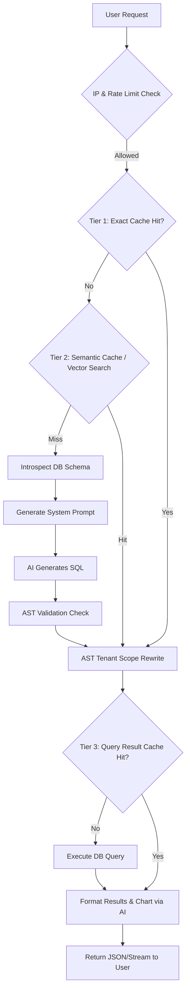

# Architecture & Engine Design

  <picture>
    
  </picture>

AskChokro is designed as a modular, stateless middleware pipeline that sits between your Web Framework, your AI Provider, and your Database.

## Core Design Principles

1. **AST-Level Security First:** AI hallucinations are inevitable. We never run raw AI SQL without passing it through a strict Abstract Syntax Tree (AST) validation and mutation phase to guarantee read-only intent and tenant isolation.
2. **Provider Agnostic:** The core engine (`@digitalchokro/core`) has zero dependencies on OpenAI, Postgres, or Express. It only talks to interfaces.
3. **Pluggable Architecture:** Every major component (AI, DB, Schema Introspection, Caching, Routing) is a swappable dependency injected at initialization.

---

## The Execution Pipeline

When `agent.ask()` is called, the request goes through a strict 8-step pipeline managed by `executePipeline()` in `packages/core/src/pipeline/agent.ts`.

### 1. Pre-Flight Checks
- **IP Whitelist:** If `options.ipWhitelist.enabled` is true, the `context.ip` is verified.
- **Rate Limiting:** Verified via the `CacheProvider` (typically Redis/In-Memory).

### 2. Multi-Tier Caching System
To achieve sub-second response times and minimize LLM token costs, AskChokro employs three cache tiers:
- **Tier 1 (Exact Match):** Checks if the exact user prompt (scoped to `tenantId`) has been generated before. Bypasses the LLM entirely.
- **Tier 2 (Semantic Cache):** Uses `@digitalchokro/vector-memory` (Cosine Similarity) to find semantically equivalent questions (e.g., "Total revenue" vs "What is my total revenue").
- **Tier 3 (Query Result Cache):** Caches the raw rows returned by the database. Ideal for dashboard widgets that poll the same queries repeatedly.

### 3. AI Generation
- The `AIProvider` generates a strict SQL `SELECT` statement using the database's specific dialect.

### 4. Security Enforcement (AST Validation & Rewriting)
- **Validation:** Parses the SQL into an AST. Enforces read-only commands (blocks `INSERT`, `UPDATE`, `DROP`, `ALTER`, etc.).
- **Tenant Isolation:** If `tenantScoping` is enabled, the AST is walked and `WHERE business_id = X` is securely appended to every relevant table reference. This prevents data leaks between SaaS tenants.

### 5. Execution (with Optional RLS)
- If native Database **Row-Level Security (RLS)** is enabled, the `DatabaseAdapter` checks out a dedicated connection, executes a `SET LOCAL` session variable command, runs the query, and commits the transaction.

---

## Package Ecosystem

AskChokro is maintained as a monorepo (via TurboRepo/pnpm) containing 19 distinct packages.

- `@digitalchokro/core`: The pipeline orchestrator.
- `@digitalchokro/askchokro`: The zero-config wrapper that detects environment variables and auto-wires the core.
- `@digitalchokro/cli`: The terminal REPL interface.
- `@digitalchokro/microservice`: The standalone Docker-ready REST API.
- **Framework Adapters:** `@digitalchokro/adapter-{express,fastify,hono,nextjs}`
- **Database Adapters:** `@digitalchokro/db-{postgres,mysql,sqlite,mssql}`
- **AI Providers:** `@digitalchokro/provider-{openai,anthropic,gemini,vertex,ollama}`
- **Extensions:** `@digitalchokro/vector-memory`, `@digitalchokro/wordpress-plugin`
