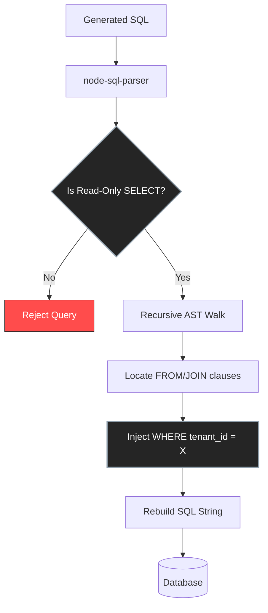

# AskChokro Security Model

<p align="center">
  <picture>
    
  </picture>
</p>

Translating Natural Language to SQL and executing it against a production database is inherently dangerous. AskChokro is built from the ground up to mitigate these risks using a **9-Layer Defense-in-Depth Model**.

## The 9-Layer Defense

1. **Read-Only DB User (Infrastructure Layer)**
   You should *always* configure AskChokro with a database user that only has `SELECT` privileges. This is your ultimate backstop. Even if all application-level checks fail, the database engine will reject destructive queries.

2. **AST-Level Query Validation**
   We do not use regex to check if a query is safe. AskChokro passes the LLM-generated SQL through `node-sql-parser`. If any root AST node is not a `SELECT` statement, the entire query is immediately rejected. This prevents SQL injection attacks attempting to append `; DROP TABLE users`.

3. **Table Allowlisting & Blocklisting**
   Before the AI even sees your schema, AskChokro filters it. If a table is not allowed, it is never sent to the LLM. Furthermore, if the LLM hallucinates and tries to query a blocked table anyway, the AST parser catches it and blocks execution.

4. **Column Masking**
   Certain columns should never be exposed, even in `SELECT` queries (e.g., `password_hash`, `stripe_customer_id`). Masked columns are stripped from the schema context, and scrubbed from the final result payload before it is sent to the client.

5. **Tenant Scope Rewriter (AST-Level)**
   *(See "Deep Dive: AST Tenant Rewriting" below)*

6. **Hard Row Caps**
   Every query is appended with a hard `LIMIT` (default 200) to prevent full-table dumps from exhausting application memory.

7. **Query Timeouts**
   Database connections are configured with strict execution timeouts to prevent the LLM from generating pathologically complex `JOIN`s that lock up your database.

8. **Prompt Injection Guards**
   The user's question is explicitly separated from the system instructions. While LLMs are susceptible to "ignore previous instructions" attacks, the AST validator (Layer 2) ensures that even if the LLM goes rogue, it can only output a valid `SELECT` statement.

9. **Audit Logging**
   With `enableAuditLog: true`, every query, tenant ID, execution time, and raw SQL string is logged for forensic analysis.

---

## Deep Dive: AST Tenant Rewriting

The hardest problem in embedding AI analytics into SaaS apps is **Multi-Tenant Isolation**. 

### The Naive Approach (And Why It Fails)
Many tools attempt to isolate tenants by string-appending a `WHERE` clause:
```javascript
const finalSql = generatedSql + ` WHERE organization_id = '${currentOrg}'`;
```

This works for simple queries:
`SELECT * FROM orders WHERE organization_id = 'org_123'`

**But it fails catastrophically on joins:**
```sql
SELECT o.amount, u.email 
FROM orders o 
JOIN users u ON o.user_id = u.id 
WHERE o.organization_id = 'org_123'
```
In this query, the `users` table is entirely unfiltered. The user can extract emails belonging to other organizations.

### The AskChokro Approach
AskChokro parses the generated SQL into an **Abstract Syntax Tree (AST)**. It then recursively walks the tree, locating every single `FROM` clause, `JOIN` target, `CTE`, and `UNION` branch.

It dynamically injects the tenant predicate directly onto *every* table reference:

```sql
SELECT o.amount, u.email 
FROM orders o 
JOIN users u ON o.user_id = u.id AND u.organization_id = 'org_123'
WHERE o.organization_id = 'org_123'
```



### Fail-Closed Design
AST manipulation is complex. If the LLM generates a highly esoteric SQL construct that our rewriter cannot confidently inject scope into (like certain correlated subqueries with external references), **AskChokro fails closed**. It will reject the query entirely rather than executing an unscoped statement. 

*AskChokro dramatically reduces risk, but cannot guarantee full isolation in all dialects. Always employ defense-in-depth.*
